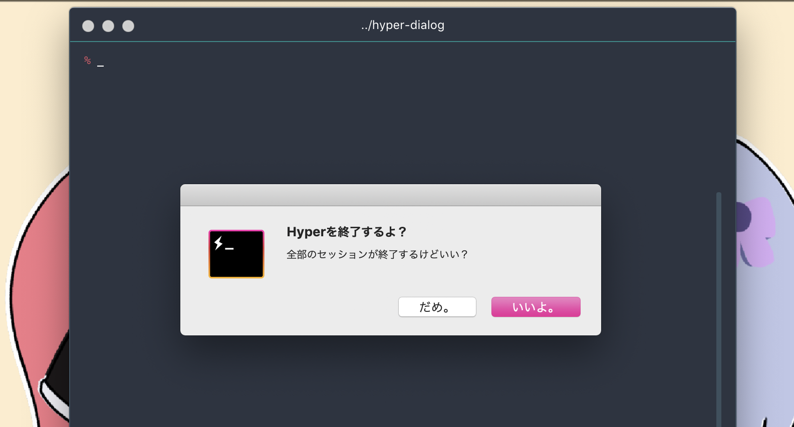

# hyper-dialog
Hyperターミナルで`cmd+q`する時にダイアログ出すやつです。

メッセージ内容などはオプションで変えられます。



## インストール
```bash
$ hyper i hyper-dialog
```

## オプション
```javascript
config: {
  // ...
  hyperDialog: {
    title: 'Hyperを終了するよ？',
    message: '全部のセッションが終了するけどいい？',
    okButton: 'いいよ。',
    cancelButton: 'だめ。',
  },
  // ...
}
```
